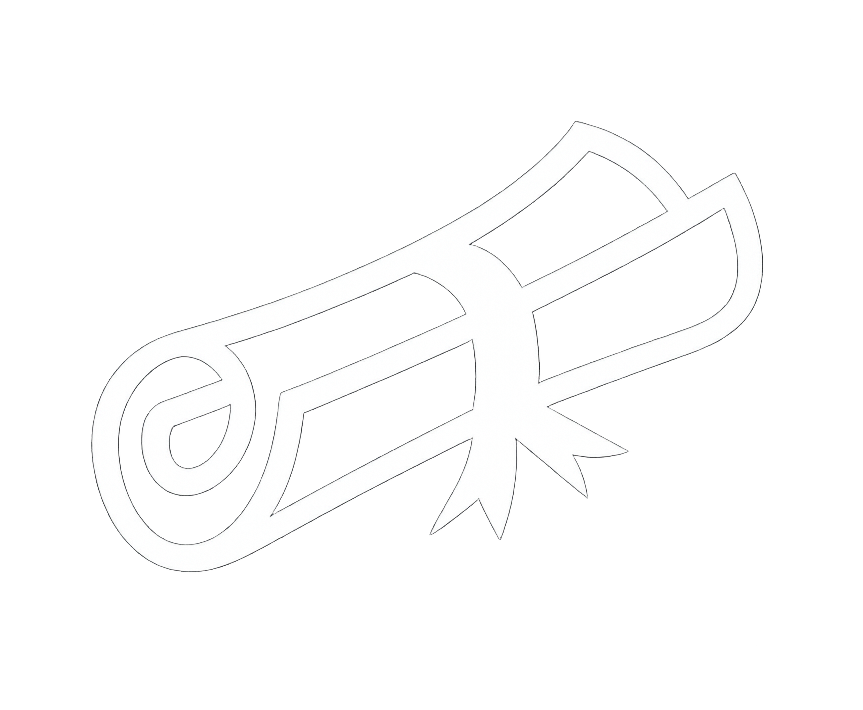

<h1 align="left">Hi 👋, I'm <strong>Kartik Pawar</strong> — Cloud & DevOps Engineer</h1>

  

  🚀 Cloud & DevOps Engineer focused on AWS, cloud infrastructure, and automation.  
  ⚙️ Building reliable CI/CD workflows, containerized deployments, and observable systems.  
  🎯 Continuously learning, improving, and building practical Cloud & DevOps projects.

## 👨‍💻 About Me

- ☁️ Cloud & DevOps Engineer
- 🔧 Hands-on with AWS and cloud infrastructure
- 🚀 CI/CD automation, containerization, and deployment
- 🐳 Docker, Kubernetes, and AWS ECS
- 🐧 Linux administration and Shell scripting
- 📊 Monitoring, logging, and observability
- 🔐 IAM, Secrets Manager, and security scanning
- 📚 Continuously learning and building practical projects

## 🌟 Projects

  <table>
    <tr>
      <td align="center">
        <a href="https://github.com/Kartikpawar143/All-AWS-Projects">
           
          <b>AWS</b>
        </a>
      </td>
      <td align="center">
        <a href="https://github.com/Kartikpawar143/All-DevOps-Projects">
           
          <b>DevOps</b>
        </a>
      </td>
      <td align="center">
        <a href="https://github.com/Kartikpawar143/All-Docker-Projects">
           
          <b>Docker</b>
        </a>
      </td>
      <td align="center">
        <a href="https://github.com/Kartikpawar143/All-Jenkins-Project">
           
          <b>Jenkins</b>
        </a>
      </td>
      <td align="center">
        <a href="https://github.com/Kartikpawar143/All-Ansible-Projects">
           
          <b>Ansible</b>
        </a>
      </td>
    </tr>
    <tr>
      <td align="center">
        <a href="https://github.com/Kartikpawar143/All-Kubernetes-Projects">
           
          <b>Kubernetes</b>
        </a>
      </td>
      <td align="center">
        <a href="https://github.com/Kartikpawar143/All-Prometheus-Projects">
           
          <b>Prometheus</b>
        </a>
      </td>
      <td align="center">
        <a href="https://github.com/Kartikpawar143/All-Grafana-Projects">
           
          <b>Grafana</b>
        </a>
      </td>
      <td align="center">
        <a href="https://github.com/Kartikpawar143/All-Teraform-Projects">
           
          <b>Terraform</b>
        </a>
      </td>
      <td align="center">
        <a href="https://github.com/Kartikpawar143/Linux-">
           
          <b>Linux</b>
        </a>
      </td>
    </tr>
    <tr>
      <td align="center">
        <a href="https://github.com/Kartikpawar143/Linux-Shell-Scripting">
           
          <b>Shell Scripting</b>
        </a>
      </td>
      <td align="center">
        <a href="https://github.com/Kartikpawar143/Coding-Related/tree/main/Core%20Java%20codes">
           
          <b>Java</b>
        </a>
      </td>
      <td align="center">
        <a href="https://github.com/Kartikpawar143/Coding-Related/tree/main/JavaScript%20codes">
           
          <b>JavaScript</b>
        </a>
      </td>
      <td align="center">
        <a href="https://github.com/Ghar-Contractor/ProjectGC">
           
          <b>ReactJS</b>
        </a>
      </td>
      <td align="center">
        <a href="https://github.com/Kartikpawar143/Certificates">
           
          <b>Certificates</b>
        </a>
      </td>
    </tr>
  </table>

  

## 🧰 Cloud & DevOps Skills

  

## 🎓 Education

- 🎓 **Bachelor of Engineering in Information Technology**
- 🏫 **Savitribai Phule Pune University**
- 📅 **2022 – 2026 | Completed**

## 📜 Certifications

- ✅ Introduction to Linux — **Linux Foundation**
- ✅ Introduction to GitOps — **Linux Foundation**
- ✅ OpenTofu Certified — **Linux Foundation**
- ✅ OCI Certified DevOps Professional — **Oracle**
- ✅ Oracle Certified Foundation Associate — **Oracle**
- 🕐 AWS Certified Cloud Practitioner — **In Progress**

## 📈 GitHub Stats

  
  

  

## 📫 Connect With Me

  Reach me through the channels below.

  <table>
    <tr>
      <td align="center">
        <a href="https://www.linkedin.com/in/kartikpawar876" target="_blank">
           
          <b>LinkedIn</b>
        </a>
      </td>
      <td align="center">
        <a href="https://medium.com/@kartikpawar1290" target="_blank">
           
          <b>Medium</b>
        </a>
      </td>
      <td align="center">
        <a href="https://www.credly.com/users/kartikpawar/badges/credly" target="_blank">
           
          <b>Credly</b>
        </a>
      </td>
    </tr>
  </table>

  Building reliable systems, automating everything possible, and continuously learning. 🚀

